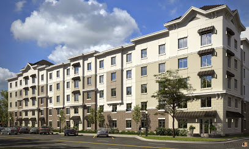

---
1title: "Rent"
output: 
  html_document:
    theme: cerulean
    code_folding: hide
    toc: true
    toc_float: true
---

**Week 1 Analysis**

```{r, include=FALSE}
library(mosaic)
library(pander)
library(tidyverse)
library(DT) 
library(pander)
library(ggplot2)

library(car)

Salaries%>%
group_by(rank,sex)%>%
  summarise(n())%>%
  pander

Rent <- read_csv("../Data/Rent.csv")
```

<br />


<br/>
<center>

</center>
<br/>

## Background and Purpose

Living in Rexburg as a student provides a lot of options.  Choosing from the near 60 apartment complexes for girls is no easy task.

This analysis is to help make that task a little easier.

Below is a data table showing only the apartments in Rexburg that Stephanie would be interested in.

```{r, warning=FALSE}
# Code to get you started. 
# View(...) works great in the Console, but datatable(...) must be
# used instead within an R-chunk.
Frent<-filter(Rent, Gender=="F")
Frent<-na.omit(Frent)
Frent2<-Frent %>% filter(Price<=1200)

datatable(Frent2, options=list(lengthMenu = c(3,10,30)), extensions="Responsive")

```

## Price

```{r}
Frent2<-Frent %>% filter(Price<=1200)
Frent2<-Frent2 %>% filter(MilesToCampus, Capacity, Price)
Frent2$Price<-(Frent2$Price/4)

PriceP<-Frent2 %>% ggplot(aes(x=reorder(Apartment, Price), y=Price), ylab="Price") + geom_col(fill="firebrick", color="black") + coord_flip()

PriceP + ggtitle("Complexes $300 A Month Or Less") + ylab("Cost") +xlab("Complex")

```

Stephanie wants something that is about $300 a month.  Its alittle tricky to plan between there being 3 or 4 months in a semester. To air on the side of caution we will assume a 4 month rent.  Rent covers only the semester length not the month. For example this spring semester covers 4 months, meaning a 4 month.  Regardless allocating big overshooting needs means more excess resources for Stephanie to use.  Assuming a 4 month semester that means More of these are in Stephanies price range.  The Graph above are all apartments that would be in that range.  There is little varition in the cost of Stephanies Price Range.

## Distance From Campus

```{r}

DistanceP<-Frent2 %>% ggplot(aes(x=reorder(Apartment, MilesToCampus), y=MilesToCampus), ylab="Distance") + geom_col(fill="firebrick", color="black") + coord_flip()


DistanceP + ggtitle("Distance From Campus") + ylab("Miles From Campus") +xlab("Complex")
Dist<-min(Frent2$MilesToCampus)
```

Stephanie is not clear about how close to campus she wants to be.  So I listed the apartments in her price range by their closeness to campus.  Those closest are listed at the bottom.    It seems the closest to campus is Birch Plaza.

Below is the Walking minutes, if Stephanie does not own a care.  Again taken from Stephanies Price Range

```{r}

FrentP4<-Frent2 %>% ggplot(aes(x=reorder(Apartment, WalkingMinutes), y=WalkingMinutes), ylab="Time to Walk") + geom_col(fill="firebrick", color="black") + coord_flip()

FrentP4 + ggtitle("Minutes Walking To Campus") + ylab("Minutes To Walk") +xlab("Complex")
```

The closest in walking time is Sunrie Villiage, and agian Birch Plaza.  (although I'm not sure how carrige house is farther from campus than Birth Plaza)

## Capacity

```{r}
CapacityP<-Frent2 %>% ggplot(aes(x=reorder(Apartment, Capacity), y=Capacity), ylab="Distance") + geom_col(fill="firebrick", color="black") + coord_flip()


CapacityP + ggtitle("Total Complex Capacitiy") + ylab("Number Of Students in Complex") +xlab("Complex")

```

This pulling again from those within Stephanies price range shows those that are of the greatest total capacity.  The largest is Birch Plaza again.

<!-- Write a few statements here that introduce your table of numerical summaries and what they show. -->


## Conclusion

Stephanie has set her price range at max $300 a month.  As there is little variation in this category itself.  With Price as the major limited facotr.  The data has been sorted in each area of interest to Stephanie.  If a single complex stood out as ideal in every category of interest to Stephanie it would be Birch Plaza, is the closest of all the apartments by distance and walking minutes, has the largest capacity, and is well within in her price range.  

However should she want to consider other factors among the complexes in addition to those already meeting her criterias, a table of the applicable complexes has been included below for her review.
Best of luck Stephanie! Work hard have fun and you'll love your time here!

-Gideon Miles


```{r}
datatable(Frent2, options=list(lengthMenu = c(3,10,30)), extensions="Responsive")

```


